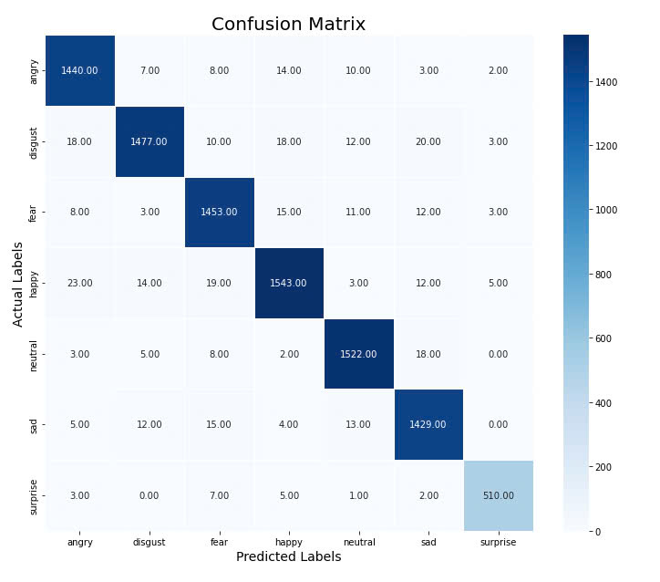

# Speech Emotion Recognition

- [Speech Emotion Recognition](#speech-emotion-recognition)
  - [Hướng dẫn cài đặt và chạy](#hướng-dẫn-cài-đặt-và-chạy)
    - [0. GPU](#0-gpu)
    - [1. Cài đặt thư viện](#1-cài-đặt-thư-viện)
    - [2. Tải trọng số (model weight)](#2-tải-trọng-số-model-weight)
    - [3. Chạy mô hình](#3-chạy-mô-hình)
  - [Using as a Library](#using-as-a-library)
  - [Confusion Matrix](#confusion-matrix)
  - [Credit](#credit)

## Hướng dẫn cài đặt và chạy

### 0. GPU

Trên Linux với NVIDIA GPU, để model có tốc độ chạy nhanh nhất,
cần cài đặt `cuda-toolkit` và `cudnn`.

Đối với Linux Mint 21.3 (hoặc Ubuntu 22.04), NVIDIA GPU (CUDA 12):

- Trước tiên làm theo [hướng dẫn tại đây](https://developer.nvidia.com/cudnn-downloads?target_os=Linux&target_arch=x86_64&Distribution=Ubuntu&target_version=22.04&target_type=deb_local) để cài `cudnn`.
- Chạy lệnh sau để cài `cuda-toolkit`:

    ```sh
    sudo apt install cuda-toolkit
    ```

### 1. Cài đặt thư viện

Chạy lệnh sau để cài đặt tất cả các thư viện cần thiết:

```sh
pip install .
```

### 2. Tải trọng số (model weight)

Quy ước `$PROJECT_ROOT/` là thư mục gốc của dự án.

- **Cách 1:**
  - Tạo thư mục `$PROJECT_ROOT/model_weight`
  - Truy cập link sau: <https://www.kaggle.com/datasets/nvnhat04/ser-model>
  - Tải về toàn bộ các file vào thư mục `$PROJECT_ROOT/model_weight` vừa tạo. (Có thể tải file zip sau đó giải nén vào thư mục vừa tạo.)

- **Cách 2:** Sử dụng [Kaggle CLI](https://github.com/Kaggle/kaggle-api/blob/main/docs/README.md):

    ```sh
    cd $PROJECT_ROOT
    kaggle datasets download nvnhat04/ser-model --unzip -p ./model_weight
    ```

### 3. Chạy mô hình

Chạy lệnh sau để thực thi mô hình:

```sh
python main.py
```

## Using as a Library

```sh
pip install git+https://github.com/telcenter/ser.git@main
```

Still needs to download the weights as shown above.

Example usage:

```python
from ser import SERModel

def main():
    model = SERModel(
        # Where did you download the weights to? Then specify the
        # paths accordingly.
        model_path='./model_weight/CNN_model.json',
        weights_path='./model_weight/best_model1_weights.h5'
    )
    audio_path = './test_data/surprise.wav'
    emotion = model.predict_emotion_from_wav_file(audio_path)
    print(f"Predicted emotion: {emotion}")

if __name__ == "__main__":
    main()
```

## Confusion Matrix



## Credit

[The original notebook](https://www.kaggle.com/code/mostafaabdlhamed/speech-emotion-recognition-97-25-accuracy/notebook).
